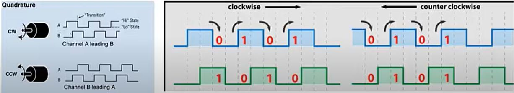

# speed-rotation_control_PID
Controlling the speed and rotation of a DC motor with an encoder using a PID controller. Using a magnetic encoder and applying the PID algorithm on ATmega328P controller with Arduino bootloader.

# rotatry magnetic encoder

